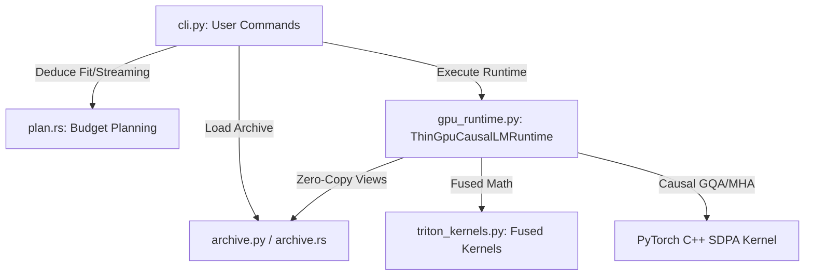

# ThinTensor

`thintensor` is a unified, high-performance command-line engine for pulling, converting, running, benchmarking, and validating causal language models. It compiles a high-speed Rust-based archive core with an optimized PyTorch/Triton GPU execution runtime.

---

## Fast-Path: Setting Up on a New Laptop

Follow these steps to set up `thintensor` from scratch on a new development machine:

### 1. Install Prerequisites
Ensure you have the following installed on your host system:
*   **Python (>= 3.10)**
*   **Rust Compiler (`cargo`)**: Install via [rustup.rs](https://rustup.rs/) if missing.
*   **NVIDIA CUDA Toolkit**: Required for GPU acceleration (ensure `nvcc` is available).

### 2. Set Up a Virtual Environment & Install PyTorch
Create a fresh python environment and install PyTorch with CUDA support:
```bash
python3 -m venv venv
source venv/bin/activate
pip install --upgrade pip

# Install PyTorch with CUDA (matching your system's CUDA version)
pip install torch --index-url https://download.pytorch.org/whl/cu121
```

### 3. Clone and Build ThinTensor
Clone the repository and install it in editable mode along with all optional dependencies:
```bash
git clone https://github.com/random-unknown-username/Thintensor.git
cd Thintensor
pip install -e '.[all]'
```
*Note: Installing the package automatically compiles the internal Rust core binaries using `setup.py`.*

### 4. Verify the Installation
Run the doctor command to ensure the GPU runtime and kernel dependencies are fully operational:
```bash
thintensor doctor --strict
```

### Quickstart: Downloading & Running a Sample Model (Qwen-0.8B)
Follow this fast-path to pull, convert, and execute a lightweight model (Qwen-0.8B):

1. **Download the Hugging Face weights**:
   ```bash
   thintensor pull Qwen/Qwen3.5-0.8B
   ```

2. **Convert the weights into a `.thin` archive**:
   ```bash
   thintensor convert ~/.cache/thintensor/models/Qwen--Qwen3.5-0.8B --out Qwen3.5-0.8B.thin
   ```

3. **Run a prompt through the native GPU runtime**:
   ```bash
   thintensor run Qwen3.5-0.8B.thin --prompt "Explain quantum computing in one sentence."
   ```

4. **Verify correctness similarity metrics**:
   ```bash
   thintensor validate Qwen3.5-0.8B.thin --hf-model ~/.cache/thintensor/models/Qwen--Qwen3.5-0.8B --profile max-max-perf --suite quick
   ```

---

## Code Architecture & Core Modules

The engine is split into a **Rust Archive & Conversion Core** and a **Python/Triton GPU Execution Runtime**. Below is a detailed map of the codebase architecture:



### 1. CLI Entrypoint & Routing
*   **CLI Handler**: [thinruntime/cli.py](file:///home/satvik/Projects/thintensor-opus/thinruntime/cli.py) manages subcommands like `run`, `pull`, `convert`, `bench`, and `validate`.
*   **Routing Engine**: The CLI inspects model metadata via `auto_fit.py` and routes to the native high-performance runtime for compatible models, falling back to Hugging Face transformers for incompatible architectures.

### 2. Rust Core (Archive & Conversion)
The Rust modules under [src/](file:///home/satvik/Projects/thintensor-opus/src) handle disk-to-memory layouts and weight packing:
*   **Archive Reader/Writer**: [src/archive.rs](file:///home/satvik/Projects/thintensor-opus/src/archive.rs) and [src/manifest.rs](file:///home/satvik/Projects/thintensor-opus/src/manifest.rs) define the binary format of `.thin` packages.
*   **Model Converter**: [src/convert_hf.rs](file:///home/satvik/Projects/thintensor-opus/src/convert_hf.rs) parses Hugging Face safetensors, mapping weights and transforming shapes into contiguous memory layouts.
*   **VRAM Budget & Fit Planner**: [src/plan.rs](file:///home/satvik/Projects/thintensor-opus/src/plan.rs) inspects available VRAM and maps which weight layers must be streamed or pinned to VRAM.

### 3. High-Performance GPU Runtime
The Python runtime classes coordinate host-device memory mapping and layer execution:
*   **ThinGpuCausalLMRuntime**: [thinruntime/gpu_runtime.py#L2490](file:///home/satvik/Projects/thintensor-opus/thinruntime/gpu_runtime.py#L2490) is the execution engine.
    *   **Memory-Mapped Zero-Copy Views**: [thinruntime/archive.py](file:///home/satvik/Projects/thintensor-opus/thinruntime/archive.py) exposes binary pages as PyTorch tensor views directly from mmap.
    *   **Forward Causal Decode**: `forward_token` (line 4828+) coordinates prefetch pipelines and sequential layer dispatch.
    *   **Gated Mixture-of-Experts (MoE)**: `_forward_token_moe` (line 6095+) runs MoE routing. When weights exceed VRAM, experts are streamed dynamically using page-pool overlays (line 6260+).
    *   **Optimized Eager RoPE**: `_apply_rope` (line 5804+) applies rotary positional embeddings. Eager position embeddings are applied in-place to avoid allocations while matching Hugging Face precision perfectly.
    *   **Scaled Dot-Product Attention**: `_attention` (line 5948+) leverages PyTorch's native C++ `scaled_dot_product_attention` for fast GQA/MHA execution.

### 4. Triton Custom Kernels
*   **Fused Normalization**: [thinruntime/triton_kernels.py](file:///home/satvik/Projects/thintensor-opus/thinruntime/triton_kernels.py) implements fused `add_rms_norm` and SwiGLU operations to bypass PyTorch intermediate launch overheads.

---

## Profiles & Configuration

Profiles are intent-based presets defined in [thinruntime/profile_presets.py](file:///home/satvik/Projects/thintensor-opus/thinruntime/profile_presets.py):

*   **`safe`**: Preserves full precision (BF16) weights and KV history with the broadest compatibility.
*   **`balanced`**: Enables native matvec and GQA/MHA attention kernels without weight compression.
*   **`max-performance`**: Opt-in profile targeting INT8 body and tensor-core quantization.
*   **`max-max-perf`**: The most aggressive execution preset combining fused projection caches, fast C++ SDPA, and custom in-place memory optimizations.

---

## Verification & Correctness Testing

Logit parity is validated step-by-step against Hugging Face references:
```bash
thintensor validate google--gemma-4-E2B.thin \
  --hf-model /path/to/original-gemma-4 \
  --profile max-max-perf \
  --suite quick
```
Validation execution isolates processes: it runs the Hugging Face trajectory first, caches reference logits, unloads it from VRAM, and then loads the `.thin` model to calculate the exact minimum cosine similarity across all tokens.

## Benchmark results


N/A because the models didnt load my 8gb vram gpu without thintensors!
